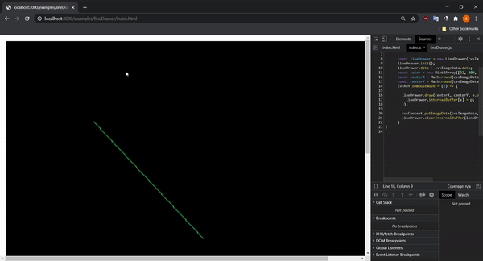

# pixelDrawer-JS
This is a simple pixel drawer. You can draw lines, circles using JS.

# How to reproduce?
1. Clone or download repo
2. Execute in terminal: **node ./startNode.js** to start Node server
3. Put in browser line: **http://localhost:3000/examples/lineDrawer/index.html**
