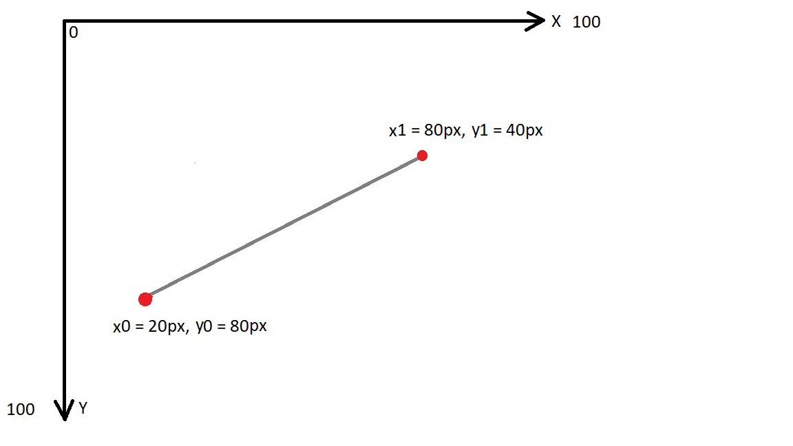

[Русский вариант](README.Ru.md)
# pixelDrawer-JS
This is a simple pixel drawer. You can draw lines, circles using JS.

# How to reproduce?
1. Clone or download repo
2. Execute this line in terminal: **node ./startNode.js** to start Node server
3. Put it in the browser line: **http://localhost:3000/examples/lineDrawer/index.html**

# How it works?
**Line Drawer**

Let's assume that we have *x0 = 20px, y0 = 80px, x1 = 80px and y1 = 40px* coordinates.
Consider the next image:

Let's walk down to our method and analyze every line of it.

    if (Math.abs(x0 - x1) < Math.abs(y0 - y1)) {
      [x0, y0] = [y0, x0];
      [x1, y1] = [y1, x1];
      steep = true;
    }
The first thing we need to understand whether our line is steep or not. Steep means that (x1 - x0) < (y1 - y0). In other words: width of line is less than height.
Our coordinates will not be steep, because (80 - 20) > (80 - 40);
If the line is steep we transpose our coordinates to make it NOT steep, so we can draw it horizontally(from left to right) again.
> **NB!** Whe should **always** draw our line from *left to right* and width should always be bigger than height.

